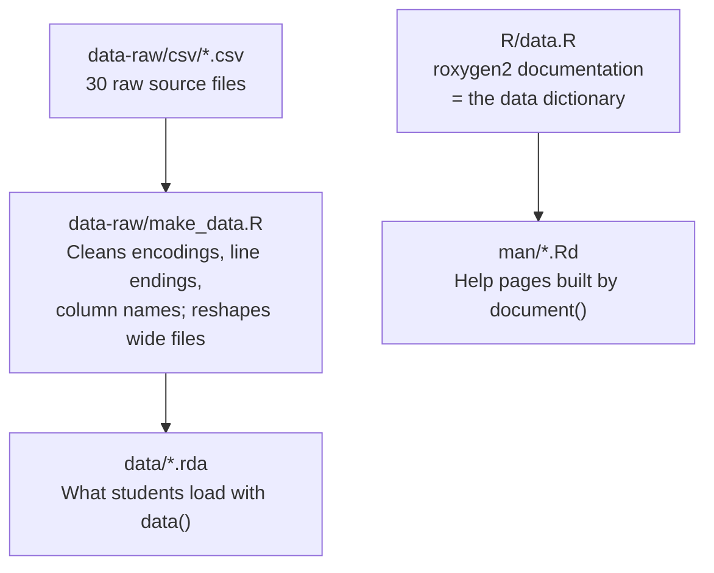

# biol202

Teaching datasets for **BIOL 202: Introduction to Biostatistics** at UBC Okanagan.
Installing this one package also installs every other R package the course uses, so
students set up their environment in a single step.

[](LICENSE.md)
[](https://creativecommons.org/licenses/by-nc-sa/4.0/)

**Maintainer**: Jason Pither — jason.pither@ubc.ca | [ORCID](https://orcid.org/0000-0002-7490-6839) | UBC Okanagan

---

## For students

### Install (once, at the start of term)

Run these two lines in the R console. The first line installs a helper package; the
second downloads and installs the course package.

```r
install.packages("remotes")
remotes::install_github("ubco-biology/biol202_ubco")
```

This takes several minutes the first time, because it also installs every other package
the course needs. You only do it once.

### Use it

```r
library(biol202)
data(birds)
head(birds)
```

> **Why does the install line say `biol202_ubco` but the library line say `biol202`?**
> The *repository* on GitHub is named `biol202_ubco`; the *package* inside it is named
> `biol202`. They differ because R does not allow underscores in package names. The
> mismatch is expected — you install from the repository name and load the package name.

### Reading the data documentation

Every dataset has a help page recording where the data came from, what each variable
means, and its units. **These help pages are the course's data dictionary.** To read one,
put a question mark in front of the dataset name:

```r
?birds                        # documentation for one dataset
data(package = "biol202")     # list every dataset in the package
```

### Loading other packages

`library(biol202)` gives you the data. It does **not** load `dplyr`, `ggplot2` and the
rest — you load those yourself, one at a time, as the tutorials show:

```r
library(dplyr)
library(ggplot2)
library(readr)
```

This is deliberate, and consistent all term. Loading packages individually means you can
always tell which package a function came from, and when something goes wrong the error
message points somewhere you can actually look.

### The tutorials

The 17 lab tutorials are a separate website:
**<https://ubco-biology.github.io/BIOL202-lab-tutorials/>**

They live separately so that corrections can be published mid-term without anyone having
to reinstall the package.

---

## Datasets

30 datasets, each with a full help page. Run `?name` for any of them.

| Dataset | Description |
|---|---|
| `bacteria` | Bacterial taxa on beech leaves |
| `bird_malaria` | Malaria infection and reproductive effort in birds |
| `birds` | Bird types observed at a marsh |
| `blackbird` | Blackbird antibody levels before and after testosterone |
| `bodytemp` | Human body temperature |
| `bumpus` | Bumpus's house sparrows |
| `cancer` | Aspirin treatment and cancer incidence |
| `circadian` | Circadian rhythm shift under three light treatments |
| `damselfly` | Direction of damselfly wing-spot rotation |
| `example_data` | Untidy example data (used to teach tidying) |
| `flowers` | Proportion of fertile flowers |
| `haircolour` | Student hair colour |
| `hostplant` | Planthopper host-plant choice |
| `humangenelength` | Human gene lengths |
| `locust` | Serotonin levels in locusts |
| `marine` | Biomass ratio in marine reserves |
| `myco_status` | Mycorrhizal status of plant species |
| `plantbiomass` | Plant diversity and ecosystem stability |
| `plantpersistence` | Plant persistence under isolation treatments |
| `plumage` | Bird plumage colour and habitat |
| `sewage` | Phosphorus upstream and downstream of sewage treatment plants |
| `stalkies` | Stalk-eyed fly eyespan |
| `students` | Physical measurements of BIOL 202 students |
| `subset_students` | Physical measurements of 30 BIOL 202 students |
| `tigerdeaths` | Human deaths caused by tigers, by activity |
| `titanic` | Survival of Titanic passengers |
| `trick` | Experience and impressiveness of a magic trick |
| `trout` | Trout caught at three lakes |
| `wolf` | Wolf inbreeding and reproduction |
| `worm` | Parasite infection and being eaten |

---

## For maintainers

### How the datasets are built

The `.rda` files in `data/` are **never edited by hand**. They are rebuilt from the raw
CSV files by one script, so the bundled data can never silently drift from its source.



To rebuild after changing a raw CSV:

```r
source("data-raw/make_data.R")   # rebuild data/*.rda from data-raw/csv/
devtools::document()             # rebuild man/*.Rd from R/data.R
devtools::check()                # rebuild and run all checks
```

The cleaning step exists because the original CSVs carried three problems that reliably
confuse first-time R users: an invisible "byte order mark" character at the start of most
files, which corrupts the first column name; inconsistent line endings, two of which made
every row collapse onto a single line; and mixed naming styles between columns. Cleaning
once here solves these permanently instead of having ~280 students each hit them in week 1.

### The expected `R CMD check` NOTE

`R CMD check` reports:

```
Namespaces in Imports field not imported from: ... All declared Imports should be used.
```

**This NOTE is expected and should not be "fixed."** The packages listed in `Imports` are
not used by this package's own code — they are declared so that installing `biol202`
installs everything *students* need, in one step. Moving them to `Suggests` would stop
them being installed; moving them to `Depends` would attach them all on
`library(biol202)`, contradicting the load-packages-individually convention taught all
term. See `?biol202` for the full rationale.

### Project structure

```
biol202/
├── DESCRIPTION            # Package metadata; Imports lists every course package
├── NAMESPACE              # Generated by roxygen2 — do not edit
├── R/
│   ├── biol202-package.R  # Package-level help page (?biol202)
│   └── data.R             # roxygen2 docs for all 30 datasets — the data dictionary
├── data/                  # Built .rda datasets — regenerate, never hand-edit
├── data-raw/
│   ├── csv/               # Raw source CSVs
│   └── make_data.R        # Cleans CSVs → data/*.rda
├── man/                   # Generated help pages — do not edit
├── tests/testthat/
│   └── test-data-documentation.R   # Checks every dataset is documented
├── LICENSE.md             # MIT (code)
└── LICENSE-CONTENT.md     # CC BY-NC-SA 4.0 (content) + third-party data provenance
```

### Releasing for a term

Tag a release each September so the version students install is fixed for the term and
the course is reproducible after the fact:

```bash
git tag -a v2026.1 -m "WT1 2026 term release"
git push origin v2026.1
```

Students then install the pinned version with
`remotes::install_github("ubco-biology/biol202_ubco@v2026.1")`.

---

## System requirements

- **R** ≥ 3.5 (developed and tested on R 4.5.2, macOS)
- **Internet connection** for the initial install only
- No external (non-R) tools required

---

## Licence

Dual-licensed, because the package contains two different kinds of thing:

- **Code** (`R/`, `data-raw/`, `tests/`) — [MIT](LICENSE.md)
- **Content and data** (dataset documentation and the bundled datasets) —
  [CC BY-NC-SA 4.0](https://creativecommons.org/licenses/by-nc-sa/4.0/)

Many bundled datasets accompany Whitlock, M. C. & Schluter, D., *The Analysis of
Biological Data*, and are redistributed here under CC BY-NC-SA 4.0, the licence under
which their authors published them. Note that many values in those datasets were
digitized from figures and tables in the original papers, so they are teaching
reconstructions rather than the primary measurements. Full provenance, including
per-dataset sources, is in [`LICENSE-CONTENT.md`](LICENSE-CONTENT.md) and in each
dataset's `@source` field in the help pages.

---

## How to cite

> Pither, J. (2026). *biol202: Teaching Datasets for BIOL 202, Introduction to
> Biostatistics* [R package]. UBC Okanagan.
> https://github.com/ubco-biology/biol202_ubco

[TODO: add the version tag once the first term release is cut, and a Zenodo DOI if the
package is archived for citation.]
